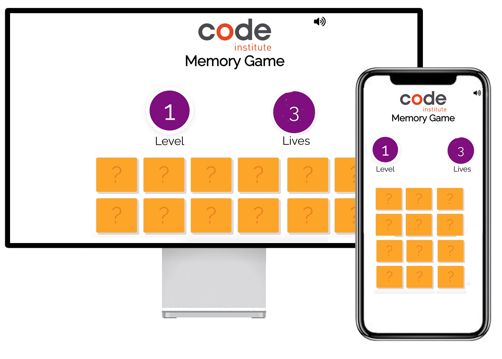

<h1 align="center">The Code Institute Memory Game</h1>

[View the live project here.](https://ukkpower.github.io/Interactive-Frontend-Development-Milestone-Project/)

The Code Institute Memory app is a classic find the matching pairs card game. Test your memory over progressively challenging levels to get the ultimate score. Every level gives you a limited number of lives so choose wisely and use your memory to the best of its ability.

The cards are based on a programming theme and for a *bonus point see can you name the languages.

The game is browser based and also can be directly installed onto desktop and mobile devices to be played offline. No app store needed. 

*Disclaimer - no bonus points given but well done if you can name them all :-)

## User Experience (UX)

### User stories

#### First Time Visitor Goals
- As a first time visitor I want to quickly understand the rules to the game by visualy looking at the level, lives and cards sections without instruction.
- As a first time visitor I want to be able to get instant feedback when a pair of crads dont match
- As a first time visitor I want to be able to feel challenged enough to come back and play again

#### Returning Visitor Goals
- As a returning visitor I want to be able to be able to play on any device or offline

#### Frequent User Goals
- As a Frequent User, I want the right level of challenge to encourage repeated playing

### Wireframes

<h2 align="center"></h2>

## Design
The app was designed be clean and minimal with the key  information easyily readable. The game was designed to be instantly playable without instruction.

## Technologies Used

### Languages Used

- [HTML5](https://en.wikipedia.org/wiki/HTML5)
- [CSS3](https://en.wikipedia.org/wiki/Cascading_Style_Sheets)
- [Javascript](https://en.wikipedia.org/wiki/Cascading_Style_Sheets)

### Frameworks, Libraries & Programs Used

1. [Google Fonts:](https://fonts.google.com/)
    - Google fonts were used to import the 'Asap' and 'Roboto' font into the style.css file which is used on all pages throughout the project.
1. [jQuery:](https://jquery.com/)
    - jQuery came with Bootstrap to make the navbar responsive but was also used for the smooth scroll function in JavaScript.
1. [Git](https://git-scm.com/)
    - Git was used for version control by utilizing the Gitpod terminal to commit to Git and Push to GitHub.
1. [GitHub:](https://github.com/)
    - GitHub is used to store the projects code after being pushed from Git.
1. [Photoshop:](https://www.adobe.com/ie/products/photoshop.html)
    - Photoshop was used to create the logo, resizing images and editing photos for the website.
1. [Javascript Fluid Meter:](https://github.com/aarcoraci)
    - Js Fluid Meter was used for the visual effect of the lives counter.
1. [Google Workbox:](https://developers.google.com/web/tools/workbox)
    - Workbox is a set of libraries that can power a production-ready service worker for your Progressive Web App

## Testing

The W3C Markup Validator and W3C CSS Validator Services were used to validate every page of the project to ensure there were no syntax errors in the project.

-   [W3C Markup Validator](https://validator.w3.org/) - [Results](https://github.com/)
-   [W3C CSS Validator](https://jigsaw.w3.org/css-validator/#validate_by_input) - [Results](https://github.com/)

The website has been tested on multiple device to ensure it is fully responsive.

Lighthouse in Chrome DevTools was used to test performance and accesibility.

## Installing Offline

This game was designed to be a Progess Wed App untilising service workers to cache files for offline playing.

To install on desktop you can use Chrome. Click the menu dots and selct install app.

For IOS the Safari browser can only be used. First click the share icon and then add to home screen. To play offline you must open the saved app while online so the iPhone will cache the files. After which the game came be played without internet connection.

## Editing Game Settings

The game contains a seetings file "data/gameData.js" where the number of levels can be change along with there lives and cards. The format of this file is JSON.

## Customising cards

The game comes with a programing theme which can be changed to anything else by editing the "data/cardData.js". The format of this files is JSON

### Testing User Stories from User Experience (UX) Section

First Time Visitor

- As a first time visitor I want to quickly understand the rules to the game by visualy looking at the level, lives and cards sections without instruction.
    - minimal design is used to highligh the main game dynamics
    - all functions are contained on the one page
- As a first time visitor I want to be able to get instant feedback when a pair of cards dont match
    - the turn back over
    - lives decrease
    - error sound is produced
- As a first time visitor I want to be able to feel challenged enough to come back and play again
    - Level progression machanic is a feature
    - limited number of lives per level

#### Returning Visitor Goals

- As a returning visitor I want to be able to be able to play on any device or offline
    - the game is a progressive web app using serice workers for offline caching

#### Frequent User Goals

- As a Frequent User, I want the right level of challenge to encourage repeated playing
    - a score system is built in whic score is calculated by multipling the lives remaining with the number of cards

### Further Testing

- The Website was tested on all major browsers Google Chrome, Internet Explorer, Microsoft Edge and Safari.
- The website was viewed on a variety of devices such as Desktop, Laptop, iPhone7, iPhone 8 & iPhoneX.
- All links were fully tested using the tool https://www.deadlinkchecker.com/website-dead-link-checker.asp
- Friends and family members were asked to review the site and documentation to point out any bugs and/or user experience issues. 
- An issue and bug tracking form was created to capture and organise issues https://docs.google.com/forms/d/e/1FAIpQLSft8mJYTlqxVhtz-Ol0962CKCOQK691BjdwLPoy6QiQJ7W2mQ/viewform?usp=sf_link

### Known Bugs

- Although PWA are now support since IOS 13. The experience is still lacking ease of install and cache issues
- JS Fluid meter design is not quite aligned to the mockup

## Deployment

### GitHub Pages

The project was deployed to GitHub Pages using the following steps...

1. Log in to GitHub and locate the [GitHub Repository](https://github.com/)
2. At the top of the Repository (not top of page), locate the "Settings" Button on the menu.
    - Alternatively Click [Here](https://raw.githubusercontent.com/) for a GIF demonstrating the process starting from Step 2.
3. Scroll down the Settings page until you locate the "GitHub Pages" Section.
4. Under "Source", click the dropdown called "None" and select "Master Branch".
5. The page will automatically refresh.
6. Scroll back down through the page to locate the now published site [link](https://github.com) in the "GitHub Pages" section.

### Forking the GitHub Repository

By forking the GitHub Repository we make a copy of the original repository on our GitHub account to view and/or make changes without affecting the original repository by using the following steps...

1. Log in to GitHub and locate the [GitHub Repository](https://github.com/)
2. At the top of the Repository (not top of page) just above the "Settings" Button on the menu, locate the "Fork" Button.
3. You should now have a copy of the original repository in your GitHub account.

### Making a Local Clone

1. Log in to GitHub and locate the [GitHub Repository](https://github.com/)
2. Under the repository name, click "Clone or download".
3. To clone the repository using HTTPS, under "Clone with HTTPS", copy the link.
4. Open Git Bash
5. Change the current working directory to the location where you want the cloned directory to be made.
6. Type `git clone`, and then paste the URL you copied in Step 3.

```
$ git clone https://github.com/ukkpower/Interactive-Frontend-Development-Milestone-Project
```

7. Press Enter. Your local clone will be created.

```
$ git clone https://github.com/ukkpower/Interactive-Frontend-Development-Milestone-Project
> Cloning into `CI-Clone`...
> remote: Counting objects: 10, done.
> remote: Compressing objects: 100% (8/8), done.
> remove: Total 10 (delta 1), reused 10 (delta 1)
> Unpacking objects: 100% (10/10), done.
```

Click [Here](https://help.github.com/en/github/creating-cloning-and-archiving-repositories/cloning-a-repository#cloning-a-repository-to-github-desktop) to retrieve pictures for some of the buttons and more detailed explanations of the above process.

## Credits

### Code

- [Marina Ferreira Memory Game](https://marina-ferreira.github.io/projects/js/memory-game/) was used as the basis for the card flip function.

- [Array Loop](https://stackoverflow.com/questions/3943494/how-to-loop-through-array-in-jquery): Loop array for the cards.

- [Random number](https://stackoverflow.com/questions/27406377/javascript-generate-random-number-except-some-values?rq=1) was used to generate a randon order of cards

- [Shuffle Array](https://stackoverflow.com/questions/2450954/how-to-randomize-shuffle-a-javascript-array) was used to shuffle the order of cards